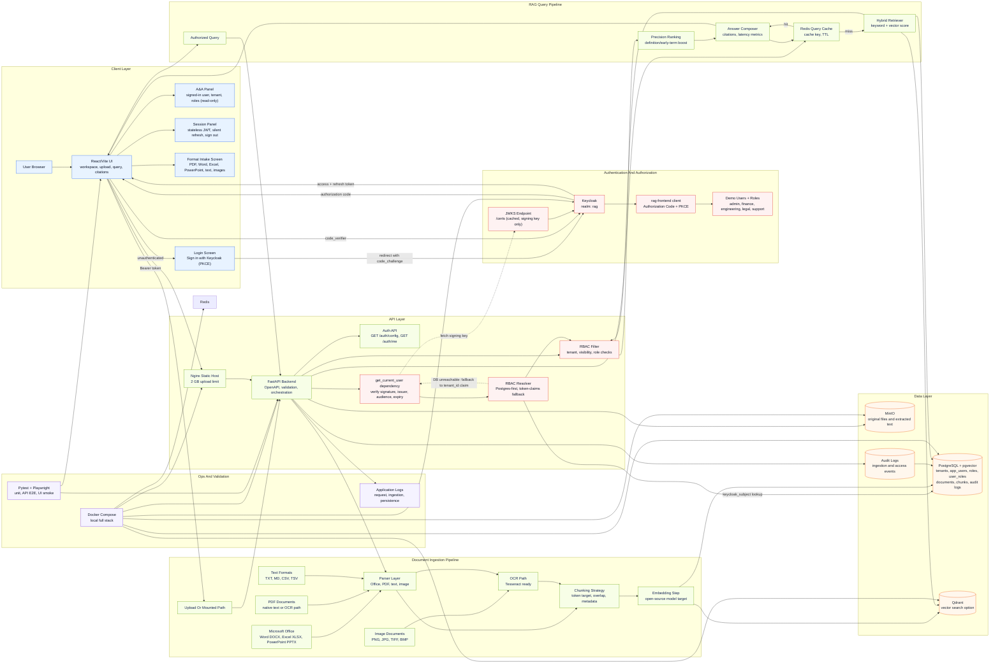

# Architecture

This architecture diagram is editable Mermaid text and renders directly in GitHub. Update the diagram by editing the Mermaid block below.

## Request Flow

1. An unauthenticated user hits the Login Screen and clicks "Sign in with Keycloak." The frontend generates a PKCE code verifier/challenge, redirects to Keycloak's authorization endpoint, and exchanges the returned code (plus verifier) for an access + refresh token directly with Keycloak -- no backend involvement in the login itself.
2. Every subsequent API call attaches the access token as `Authorization: Bearer <token>`. FastAPI's `get_current_user` dependency validates the token's signature (against Keycloak's cached JWKS), issuer, audience, and expiry before any route body runs.
3. The RBAC Resolver looks up the caller's `tenant_id` and roles from PostgreSQL (`app_users` / `roles` / `user_roles`, keyed by the token's `sub`), falling back to a `tenant_id` token claim and `realm_access.roles` only if the database is unreachable. Request bodies can no longer supply their own `tenant_id` or roles.
4. Users upload documents or provide a mounted path through the React/Vite UI; `tenant_id` and the uploader's identity are taken from the resolved identity, not the request.
5. FastAPI extracts text from supported document types, invokes OCR when needed, and chunks the extracted text. Chunks are enriched with tenant, document, visibility, role, owner, and source metadata.
6. Metadata and chunks are persisted in PostgreSQL. Qdrant is included as the vector search option for scale-oriented retrieval.
7. Users ask questions through the query panel; `tenant_id` and roles again come from the resolved identity.
8. Redis is checked for cached answers (the cache key includes the requester's identity so private-document results never leak across users). On cache miss, retrieval runs against authorized chunks, applies RBAC filters (tenant match, then tenant/role/private-owner visibility), ranks contexts, and composes an answer with citations and latency metrics.
9. Access tokens are short-lived and stateless (no server-side session store); the frontend silently refreshes them in the background via Keycloak's refresh-token grant and clears its session if the refresh fails, dropping the user back to the Login Screen.

## Component Responsibilities

- React/Vite UI: PKCE login/logout, document upload, mounted-path ingestion, read-only A&A and session status display, query form, citations, cache status, and latency display.
- FastAPI backend: bearer-token validation, RBAC resolution, request validation, ingestion orchestration, retrieval orchestration, persistence, and API contracts.
- Keycloak: identity provider for OAuth/OIDC (Authorization Code + PKCE for the SPA), issues and refreshes JWTs, exposes the JWKS used to validate them, and owns realm roles and demo users.
- PostgreSQL + pgvector: tenant metadata, RBAC tables (`app_users`, `roles`, `user_roles`) as the source of truth for tenant/role resolution, document records, chunk records, and audit logs.
- Redis: query cache and future queue/rate-limit support.
- MinIO: target object storage for original files and extracted text.
- Qdrant: optional vector index for higher-scale retrieval experiments.
- Docker Compose: local reproducible stack for the POC, including a `--import-realm` Keycloak boot that seeds the `rag` realm from `infra/keycloak/realm-export.json`.

## Authentication, Authorization And Session Management

- **Login**: Authorization Code + PKCE against Keycloak's `rag-frontend` public client. No client secret is used or needed.
- **Token validation**: `app/auth/tokens.py` verifies signature (RS256, via a cached JWKS lookup by `kid`), `iss`, `aud`, and `exp` on every request. Keycloak's JWKS includes both a signing key (`use=sig`) and an encryption key (`use=enc`); only the signing key is used to validate tokens.
- **Authorization (RBAC)**: `app/auth/service.py` resolves tenant and roles from Postgres by `keycloak_subject`, falling back to a `tenant_id` custom claim and `realm_access.roles` if the database is unreachable. `require_roles(...)` gates specific endpoints; chunk-level visibility (`tenant`, `role`, `private`) is enforced in `app/rag/retrieval.py` for every retrieval and direct chunk lookup.
- **Session management**: stateless JWTs -- there is no server-side session store or logout blacklist. The frontend holds tokens in `sessionStorage` (cleared when the tab closes), refreshes them silently ~30s before expiry via Keycloak's refresh-token grant, and redirects to Keycloak's end-session endpoint on sign-out.
- **Demo identities**: `infra/keycloak/realm-export.json` and `infra/postgres/init.sql` seed matching Keycloak users and Postgres `app_users`/`roles` rows for one demo user per role (`admin-demo`, `finance-demo`, `engineer-demo`, `legal-demo`, `support-demo`; password `Passw0rd!`). See [Setup Guide](setup.md#signing-in-keycloak).

## Supported Document Formats

- PDF: native text extraction with OCR fallback path for scanned/image-backed documents.
- Microsoft Word: DOCX extraction.
- Microsoft Excel: XLSX sheet/cell extraction.
- Microsoft PowerPoint: PPTX slide text extraction.
- Text: TXT, Markdown, CSV, and TSV.
- Images: PNG, JPG, JPEG, TIFF, and BMP through OCR.

Legacy binary Office formats such as DOC, XLS, and PPT should be converted to DOCX, XLSX, or PPTX before ingestion for this POC.

## Editable Diagram Notes

- GitHub renders Mermaid blocks automatically in Markdown.
- The diagram can be copied into Mermaid Live Editor or diagrams.net Mermaid import for visual editing.
- Keep infrastructure-specific host paths out of this file; use `.env` for local overrides.
