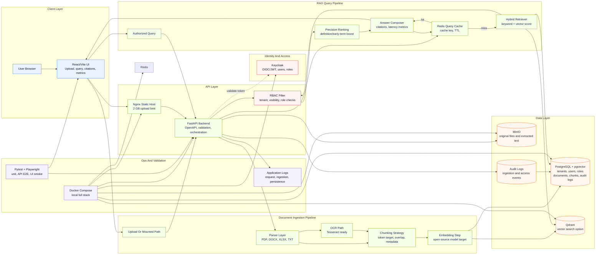

# Architecture

This architecture diagram is editable Mermaid text and renders directly in GitHub. Update the diagram by editing the Mermaid block below.

## Request Flow

1. Users upload documents or provide a mounted path through the React/Vite UI.
2. FastAPI validates the request, extracts text from supported document types, invokes OCR when needed, and chunks the extracted text.
3. Chunks are enriched with tenant, document, visibility, role, OCR, and source metadata.
4. Metadata and chunks are persisted in PostgreSQL. Qdrant is included as the vector search option for scale-oriented retrieval.
5. Users ask questions through the query panel.
6. Redis is checked for cached answers. On cache miss, retrieval runs against authorized chunks, applies RBAC filters, ranks contexts, and composes an answer with citations and latency metrics.

## Component Responsibilities

- React/Vite UI: document upload, mounted-path ingestion, tenant/role input, query form, citations, cache status, and latency display.
- FastAPI backend: request validation, ingestion orchestration, retrieval orchestration, persistence, and API contracts.
- Keycloak: target identity provider for OAuth/OIDC, JWT validation, and member roles.
- PostgreSQL + pgvector: tenant metadata, RBAC tables, document records, chunk records, and audit logs.
- Redis: query cache and future queue/rate-limit support.
- MinIO: target object storage for original files and extracted text.
- Qdrant: optional vector index for higher-scale retrieval experiments.
- Docker Compose: local reproducible stack for the POC.

## Editable Diagram Notes

- GitHub renders Mermaid blocks automatically in Markdown.
- The diagram can be copied into Mermaid Live Editor or diagrams.net Mermaid import for visual editing.
- Keep infrastructure-specific host paths out of this file; use `.env` for local overrides.
