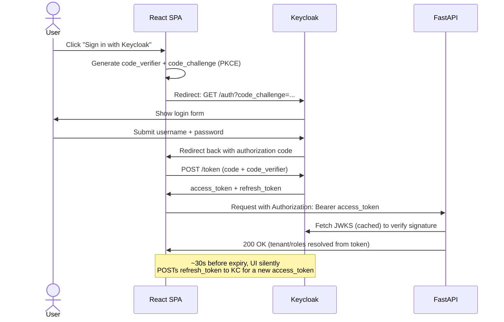

# Architecture

This architecture diagram is editable Mermaid text and renders directly in GitHub. Update the diagram by editing the Mermaid block below. For focused sequence/activity diagrams, see [Flow Diagrams](flow-diagrams.md).

```mermaid
flowchart TD
  %% Client layer
  subgraph client["Client Layer"]
    browser["User Browser"]
    ui["React/Vite UI<br/>workspace, upload, query, citations"]
    loginScreen["Login Screen"]
    aaScreen["A&A Panel<br/>tenant + roles (read-only)"]
    sessionScreen["Session Panel<br/>stateless JWT, silent refresh"]
    formatsScreen["Format Intake Screen"]
    docInventory["Document Management Panel<br/>inventory, detail, chunk preview"]
    jobStatus["Job Status Cards<br/>queued, processing, failed, retry, completed"]
    analyticsScreen["Admin Analytics Panel<br/>documents, jobs, query metrics, audit events, eval"]
  end

  %% Identity
  subgraph identity["Keycloak (realm: rag)"]
    keycloak["OIDC / PKCE + JWKS"]
    demoUsers["Roles: admin, finance,<br/>engineering, legal, support"]
  end

  %% Edge and API
  subgraph api["API Layer"]
    nginx["Nginx Static Host"]
    fastapi["FastAPI Backend"]
    authApi["Auth API<br/>/auth/config, /auth/me"]
    jwtValidate["get_current_user<br/>verify sig, iss, aud, exp"]
    rbacResolve["RBAC Resolver<br/>Postgres-first, claims fallback"]
    authz["RBAC Filter<br/>tenant, visibility, role"]
    docMgmtApi["Document Management API<br/>list/detail authorized docs"]
    jobApi["Processing Job API<br/>status + local run"]
    modelStatusApi["Model Status API<br/>/api/v1/model-status"]
    analyticsApi["Analytics API<br/>/api/v1/analytics"]
  end

  %% Ingestion pipeline
  subgraph ingestion["Document Ingestion Pipeline"]
    upload["Upload Or Mounted Path"]
    queue["Redis Processing Queues<br/>normal + OCR"]
    worker["Default Worker Process<br/>python -m app.worker"]
    ocrWorker["OCR Worker Process<br/>python -m app.worker"]
    parser["Parser Layer<br/>Office, PDF, text, image"]
    ocr["OCR Path<br/>Tesseract ready"]
    chunker["Chunking Strategy<br/>token target, overlap, metadata"]
    embed["Embedding Step"]
  end

  %% Retrieval pipeline
  subgraph retrieval["RAG Query Pipeline"]
    query["Authorized Query"]
    cache["Redis Query Cache"]
    provider["Model Provider<br/>embedding + answer interfaces"]
    hostOllama["Mac Host Ollama<br/>host.docker.internal:11434"]
    composeOllama["Optional Compose Ollama<br/>ollama:11434"]
    retriever["Hybrid Retriever"]
    ranker["Precision Ranking"]
    answer["Answer Generator<br/>extractive or Ollama"]
    eval["Offline Eval Runner<br/>precision, recall, relevance"]
  end

  %% Data plane
  subgraph data["Data Layer"]
    postgres[("PostgreSQL + pgvector<br/>tenants, app_users, roles<br/>documents, chunks, audit")]
    qdrant[("Qdrant")]
    minio[("MinIO")]
  end

  %% Observability and testing
  subgraph ops["Ops And Validation"]
    docker["Docker Compose"]
    tests["Pytest + Playwright"]
    analyticsRollup["Tenant Analytics Rollup"]
  end

  browser --> ui
  ui --> loginScreen
  ui --> aaScreen
  ui --> sessionScreen
  ui --> formatsScreen
  ui --> docInventory
  ui --> jobStatus
  ui --> analyticsScreen
  loginScreen <-- PKCE login --> keycloak
  keycloak --- demoUsers

  ui -- Bearer token --> nginx --> fastapi
  fastapi --> authApi
  fastapi --> docMgmtApi
  fastapi --> jobApi
  fastapi --> modelStatusApi
  fastapi --> analyticsApi
  fastapi --> jwtValidate
  jwtValidate -. validate via JWKS .-> keycloak
  jwtValidate --> rbacResolve
  rbacResolve -- lookup by keycloak_subject --> postgres
  fastapi --> authz
  rbacResolve --> authz
  docMgmtApi --> authz
  docMgmtApi --> postgres
  docMgmtApi --> docInventory
  jobApi --> authz
  jobApi --> postgres
  jobApi --> jobStatus
  modelStatusApi --> provider
  analyticsApi --> analyticsRollup
  analyticsRollup --> postgres
  analyticsRollup --> eval
  analyticsApi --> analyticsScreen

  fastapi --> upload --> parser
  upload --> queue
  queue --> worker --> parser
  queue --> ocrWorker --> parser
  parser --> ocr --> chunker
  parser --> chunker
  chunker --> embed --> postgres
  embed --> qdrant

  fastapi --> query --> cache
  cache -- hit --> answer
  cache -- miss --> provider
  provider -. LOCAL_*_BASE_URL .-> hostOllama
  provider -. local-models profile .-> composeOllama
  provider --> retriever
  retriever --> postgres
  retriever --> qdrant
  retriever --> authz --> ranker --> answer --> cache
  provider --> answer
  eval -. quality gate .-> retriever
  eval -. quality gate .-> answer

  docker -.-> fastapi
  docker -.-> worker
  docker -.-> ocrWorker
  docker -.-> postgres
  docker -.-> keycloak
  tests -.-> fastapi

  classDef client fill:#e8f3ff,stroke:#2563eb,color:#0f172a;
  classDef service fill:#f7fee7,stroke:#65a30d,color:#172554;
  classDef data fill:#fff7ed,stroke:#ea580c,color:#1f2937;
  classDef security fill:#fef2f2,stroke:#dc2626,color:#111827;
  classDef ops fill:#f5f3ff,stroke:#7c3aed,color:#111827;

  class browser,ui,loginScreen,aaScreen,sessionScreen,formatsScreen,docInventory,jobStatus,analyticsScreen client;
  class nginx,fastapi,authApi,docMgmtApi,jobApi,modelStatusApi,analyticsApi,upload,queue,worker,ocrWorker,parser,ocr,chunker,embed,query,cache,provider,hostOllama,composeOllama,retriever,ranker,answer,eval service;
  class postgres,qdrant,minio data;
  class keycloak,demoUsers,jwtValidate,rbacResolve,authz security;
  class docker,tests,analyticsRollup ops;
```

The system diagram above deliberately collapses the login handshake into a single `loginScreen <--> keycloak` edge. Here's that handshake unpacked as its own sequence diagram:

## Request Flow

1. An unauthenticated user hits the Login Screen and clicks "Sign in with Keycloak." The frontend generates a PKCE code verifier/challenge, redirects to Keycloak's authorization endpoint, and exchanges the returned code (plus verifier) for an access + refresh token directly with Keycloak -- no backend involvement in the login itself.
2. Every subsequent API call attaches the access token as `Authorization: Bearer <token>`. FastAPI's `get_current_user` dependency validates the token's signature (against Keycloak's cached JWKS), issuer, audience, and expiry before any route body runs.
3. The RBAC Resolver looks up the caller's `tenant_id` and roles from PostgreSQL (`app_users` / `roles` / `user_roles`, keyed by the token's `sub`), falling back to a `tenant_id` token claim and `realm_access.roles` only if the database is unreachable. Request bodies can no longer supply their own `tenant_id` or roles.
4. Users upload documents or provide a mounted path through the React/Vite UI; `tenant_id` and the uploader's identity are taken from the resolved identity, not the request.
5. Synchronous upload/path ingestion can process immediately, while `upload-async` creates a pending document plus `processing_jobs` row and enqueues the job in Redis. Resumable upload-session APIs create tenant/uploader-bound sessions, accept numbered file parts, expose uploaded part status, optionally issue MinIO presigned part URLs, and complete into the same async processing path. Completed upload sessions clean up temporary part storage after assembly; abandoned sessions can be cleaned with `python -m app.rag.cleanup_upload_sessions`. Normal jobs route to `PROCESSING_QUEUE_NAME`; forced OCR jobs route to `OCR_PROCESSING_QUEUE_NAME` so OCR-heavy work can run in a separate worker service. Browser uploads are checked against configurable extension and byte-size limits before ingestion. Failed jobs can be reset to queued and re-enqueued through the retry API/UI action.
6. Workers poll Redis, reload job context from PostgreSQL when needed, extract text from supported document types, invoke OCR when needed, and chunk the extracted text. Image OCR calls Tesseract directly; scanned/image-backed PDF OCR renders pages with PyMuPDF before sending them to Tesseract. Chunks are enriched with tenant, document, visibility, role, owner, and source metadata.
7. Metadata and chunks are persisted in PostgreSQL. Embeddings can be indexed through the vector-index boundary: in-memory by default for deterministic local/test runs, pgvector when `VECTOR_INDEX_BACKEND=pgvector` and DB persistence are enabled, or Qdrant when `VECTOR_INDEX_BACKEND=qdrant`. `python -m app.rag.vector_ops` checks the selected vector backend, ensures Qdrant payload indexes, and backfills persisted chunks into the selected vector index.
8. The Document Management panel calls list/detail APIs to show only authorized document metadata and chunk previews for the caller's tenant/roles. The UI also polls processing job status until queued uploads complete or fail, the Evaluation panel calls `/api/v1/evaluation/retrieval` to show the retrieval quality gate, and the Admin Analytics panel calls `/api/v1/analytics` to show tenant-scoped document, job, persisted query-cache, vector/reranker retrieval, audit-event, latency, and evaluation health.
9. Users ask questions through the query panel; `tenant_id` and roles again come from the resolved identity.
10. Redis is checked for cached answers (the cache key includes the requester's identity plus provider/runtime/model/reranker names so private-document results and model changes never leak across users or runtimes). On cache miss, the model provider supplies the embedding model for retrieval. With `LOCAL_EMBEDDING_RUNTIME=ollama`, backend/worker call either Mac-host Ollama at `http://host.docker.internal:11434` or the optional Compose Ollama service at `http://ollama:11434`. The vector index supplies authorized candidates when configured; retrieval still enforces RBAC (tenant match, then tenant/role/private-owner visibility), ranks contexts, optionally reranks them through the reranker boundary, and the provider's answer generator composes an answer with citations, model metadata, and latency metrics. With `LOCAL_LLM_RUNTIME=ollama`, answer generation calls the same configured local Ollama endpoint.
11. Successful queries write `query.executed` audit events with query hash/length, cache state, latency, contexts used, models, and cited document ids. Raw query text is not stored in `audit_logs`.
12. Access tokens are short-lived and stateless (no server-side session store); the frontend silently refreshes them in the background via Keycloak's refresh-token grant and clears its session if the refresh fails, dropping the user back to the Login Screen.

## Component Responsibilities

- React/Vite UI: PKCE login/logout, document upload, mounted-path ingestion, queued upload status and failed-job retry, read-only A&A and session status display, model runtime readiness, evaluation quality gate display, admin analytics and recent operations summary, format guidance, document inventory/detail/chunk preview with extraction warnings, query form, citations, cache status, and latency display.
- FastAPI backend: bearer-token validation, RBAC resolution, request validation, upload size/type guardrails, ingestion orchestration, processing job status/run/retry APIs, document inventory APIs, model runtime status API, retrieval evaluation API, admin analytics/audit API, retrieval orchestration, persistence, and API contracts.
- Keycloak: identity provider for OAuth/OIDC (Authorization Code + PKCE for the SPA), issues and refreshes JWTs, exposes the JWKS used to validate them, and owns realm roles and demo users.
- PostgreSQL + pgvector: tenant metadata, RBAC tables (`app_users`, `roles`, `user_roles`) as the source of truth for tenant/role resolution, document records, chunk records, optional chunk embeddings, pgvector ANN index, and audit logs.
- Redis: query cache plus normal and OCR-heavy processing job queues for background ingestion.
- MinIO: target object storage for original files, extracted text, and optional upload-session part storage with presigned URLs.
- Qdrant: optional vector index for higher-scale retrieval experiments.
- Docker Compose: local reproducible stack for the POC, including a `--import-realm` Keycloak boot that seeds the `rag` realm from `infra/keycloak/realm-export.json`.
- Model provider strategy: local/open-source first (`LLM_PROVIDER=local`, `EMBEDDING_PROVIDER=local`) through `app/rag/model_providers.py`. Defaults use deterministic hashing embeddings (`LOCAL_EMBEDDING_RUNTIME=hashing`), the in-memory vector index (`VECTOR_INDEX_BACKEND=memory`), no reranker (`RERANKER_PROVIDER=none`), and the extractive answer generator (`LOCAL_LLM_RUNTIME=extractive`). Ollama embeddings and answer generation are available through `LOCAL_EMBEDDING_RUNTIME=ollama` and `LOCAL_LLM_RUNTIME=ollama`; this has been smoke-tested from Docker backend/worker to Mac-host Ollama with `nomic-embed-text:latest` and `llama3.1:8b`. pgvector and Qdrant indexing are available through `VECTOR_INDEX_BACKEND`; deterministic local keyword reranking is available with `RERANKER_PROVIDER=local` and `LOCAL_RERANKER_RUNTIME=keyword`. vLLM adapters and local cross-encoder rerankers are the next local model upgrades. Public token-based LLM providers should remain disabled until explicitly needed.
- Model status: `/api/v1/model-status` reports the active embedding, answer, vector-index, and reranker runtime, model names, readiness, latency warning thresholds, and Ollama/Qdrant reachability when selected. Hashing/extractive/memory/default reranker settings report ready without network calls; Ollama runtimes check `/api/tags`; Qdrant checks the configured collection.
- Admin analytics: `/api/v1/analytics` reports tenant-scoped document, job, recent query/cache/latency, retrieval backend/reranker warning state, and audit-event rollups from PostgreSQL when persistence is enabled, falls back to in-memory document and query stores for local tests, and embeds the retrieval evaluation quality summary.

## Authentication, Authorization And Session Management

- **Login**: Authorization Code + PKCE against Keycloak's `rag-frontend` public client. No client secret is used or needed.
- **Token validation**: `app/auth/tokens.py` verifies signature (RS256, via a cached JWKS lookup by `kid`), `iss`, `aud`, and `exp` on every request. Keycloak's JWKS includes both a signing key (`use=sig`) and an encryption key (`use=enc`); only the signing key is used to validate tokens.
- **Authorization (RBAC)**: `app/auth/service.py` resolves tenant and roles from Postgres by `keycloak_subject`, falling back to a `tenant_id` custom claim and `realm_access.roles` if the database is unreachable. `require_roles(...)` gates specific endpoints; chunk-level visibility (`tenant`, `role`, `private`) is enforced in `app/rag/retrieval.py` for every retrieval and direct chunk lookup.
- **Session management**: stateless JWTs -- there is no server-side session store or logout blacklist. The frontend holds tokens in `sessionStorage` (cleared when the tab closes), refreshes them silently ~30s before expiry via Keycloak's refresh-token grant, and redirects to Keycloak's end-session endpoint on sign-out.
- **Demo identities**: `infra/keycloak/realm-export.json` and `infra/postgres/init.sql` seed matching Keycloak users and Postgres `app_users`/`roles` rows for one demo user per role (`admin-demo`, `finance-demo`, `engineer-demo`, `legal-demo`, `support-demo`; password `Passw0rd!`). See [Setup Guide](setup.md#signing-in-keycloak).

## Supported Document Formats

- PDF: native text extraction with OCR fallback path for scanned/image-backed documents. PDF OCR renders pages to images, honors `OCR_PDF_DPI` and `OCR_MAX_PDF_PAGES`, and uses `OCR_LANGUAGE` for Tesseract.
- Microsoft Word: DOCX extraction.
- Microsoft Excel: XLSX sheet/cell extraction.
- Microsoft PowerPoint: PPTX slide text extraction.
- Text: TXT, Markdown, CSV, and TSV.
- Images: PNG, JPG, JPEG, TIFF, and BMP through OCR.

Legacy binary Office formats such as DOC, XLS, and PPT should be converted to DOCX, XLSX, or PPTX before ingestion for this POC.

## Editable Diagram Notes

- GitHub renders Mermaid blocks automatically in Markdown.
- This file contains the top-down system flowchart and the PKCE login sequence. Focused async ingestion, query, analytics, and RBAC visibility diagrams live in [Flow Diagrams](flow-diagrams.md).
- Both can be copied into Mermaid Live Editor (https://mermaid.live) or diagrams.net's Mermaid import for visual editing.
- Keep infrastructure-specific host paths out of this file; use `.env` for local overrides.
