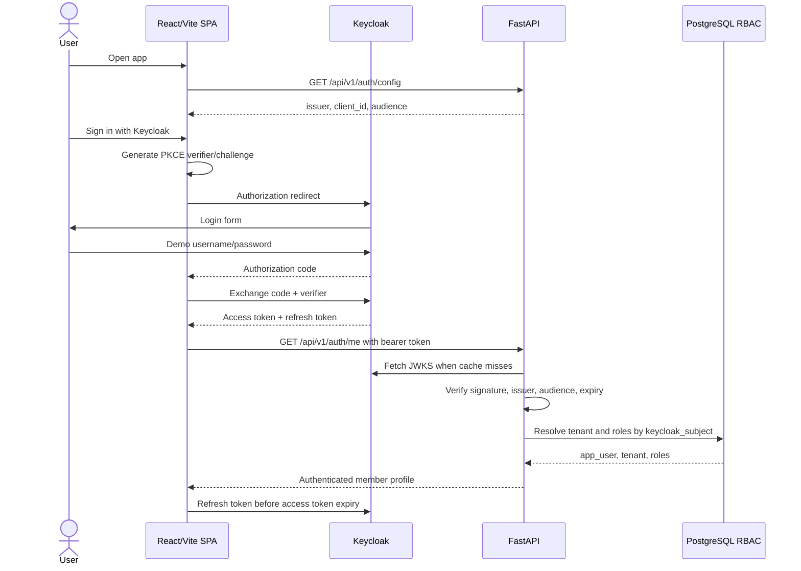
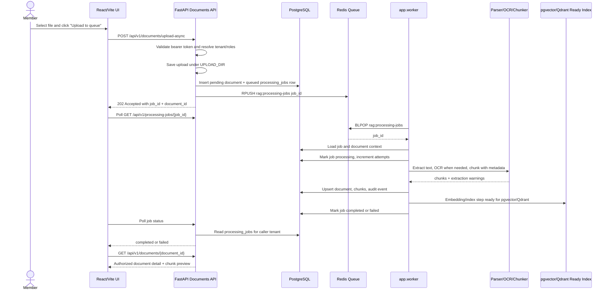
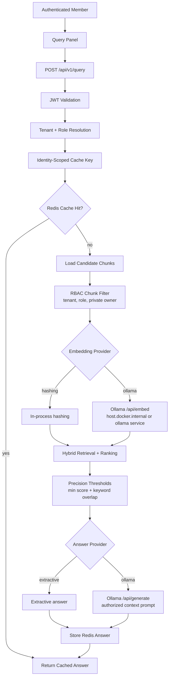
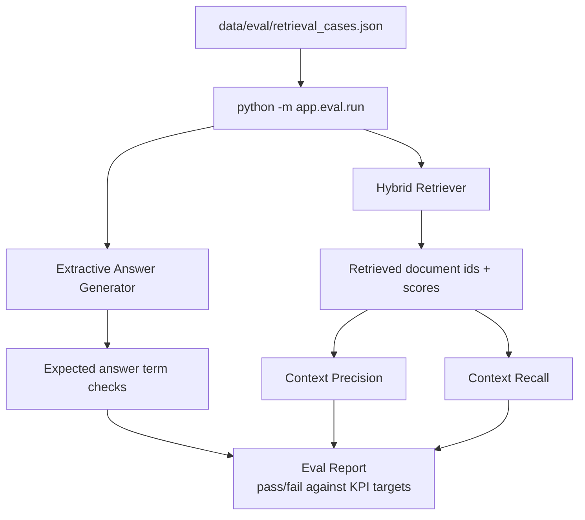
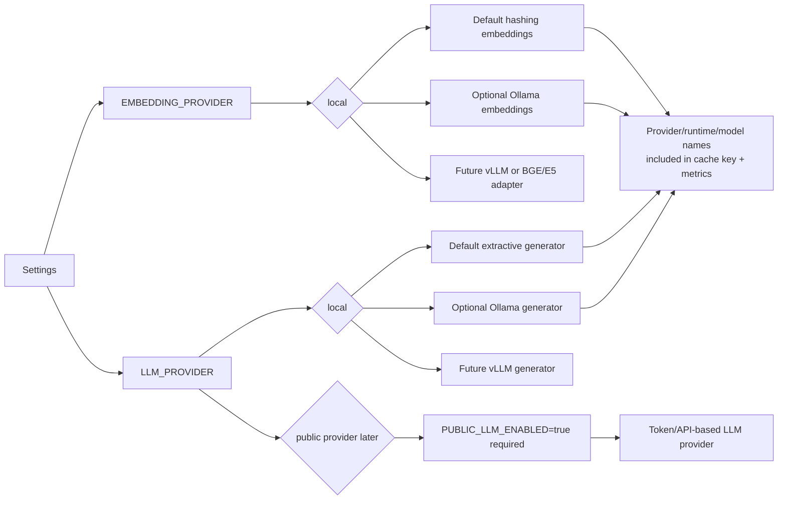
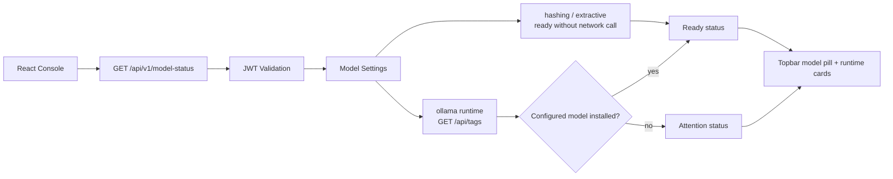
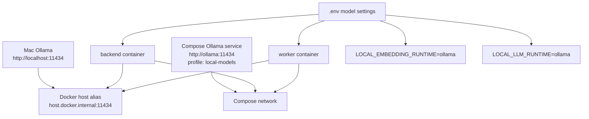
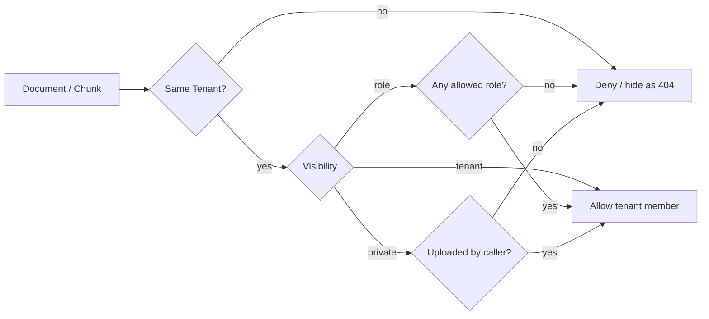
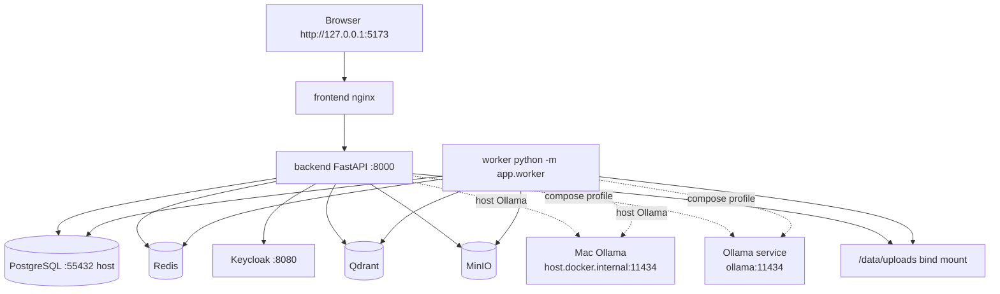

# Flow Diagrams

These diagrams are editable Mermaid text and render directly in GitHub. The top-level component map stays in [Architecture](architecture.md); this file focuses on request and data movement.

## Authentication And Session Flow

## Background Ingestion Flow

## Authorized Query Flow

## Retrieval Evaluation Flow

## Model Provider Strategy

## Model Status Flow

## Local Ollama Connectivity

## RBAC Visibility Rules

## Docker Runtime Flow

